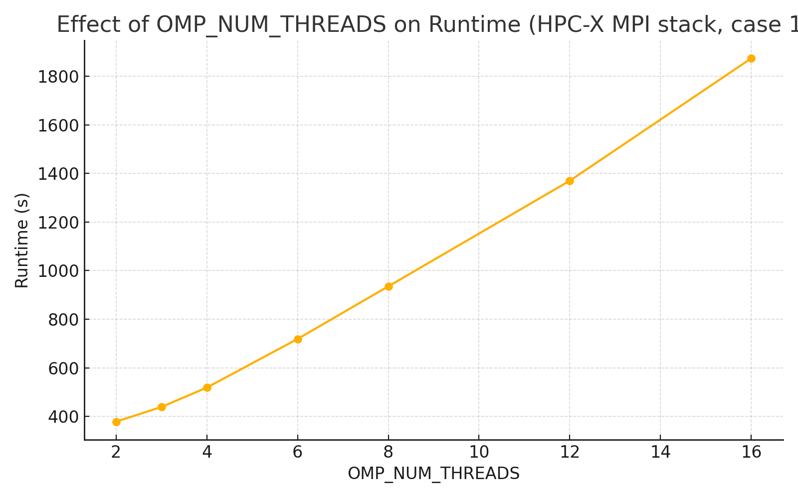

# CloverLeaf 技术报告

## 目录

- [CloverLeaf 技术报告](#cloverleaf-技术报告)
  - [目录](#目录)
  - [1. 封面](#1-封面)
  - [2. 摘要](#2-摘要)
  - [3. 问题定位](#3-问题定位)
    - [3.1 运行画像与两种瓶颈形态](#31-运行画像与两种瓶颈形态)
    - [3.2 具体通信热点](#32-具体通信热点)
    - [3.3 计算侧采样可信度（VTune）](#33-计算侧采样可信度vtune)
    - [3.4 I/O 侧](#34-io-侧)
    - [3.5 小结：原始代码的主要问题/瓶颈](#35-小结原始代码的主要问题瓶颈)
  - [4. 优化思路（Memory-Bound ）](#4-优化思路memory-bound-)
    - [4.1 运行时：拓扑/亲和与并行形态](#41-运行时拓扑亲和与并行形态)
      - [MPI×OMP 版型（两节点，每节点 48 核）](#mpiomp-版型两节点每节点-48-核)
      - [短运行的处理](#短运行的处理)
    - [4.2 编译器：面向带宽与 SIMD 的最小改动](#42-编译器面向带宽与-simd-的最小改动)
      - [链路级增强（两类编译器通用）](#链路级增强两类编译器通用)
  - [5. 实现过程](#5-实现过程)
    - [原因分析](#原因分析)
    - [intel](#intel)
    - [hpcx](#hpcx)
  - [6. 实验设置](#6-实验设置)
  - [7. 结果与讨论](#7-结果与讨论)
    - [Case 1（大算例）](#case-1大算例)
      - [基准 vs 优化：加速比与降幅](#基准-vs-优化加速比与降幅)
    - [Case 2（小算例）](#case-2小算例)
      - [基准 vs 优化：加速比与降幅](#基准-vs-优化加速比与降幅-1)
    - [总结与进一步的优化思路](#总结与进一步的优化思路)
  - [8. 可复现指引](#8-可复现指引)
  - [9. 结论](#9-结论)
  - [10. 参考文献](#10-参考文献)

## 1. 封面

- # CloverLeaf赛题技术报告
- 队伍名称：夜神骇客队

---

## 2. 摘要

本报告针对 CloverLeaf 计算流体力学应用的性能优化进行了系统分析。通过对原始代码的性能瓶颈定位，结合多种编译器、MPI 实现和运行时参数，采用了编译优化、进程亲和、合理的并行形态等方法。最终在多种算例和环境下均取得了显著的性能提升。报告详细记录了优化过程、实验结果及分析，为后续相关工作提供了参考。

---

## 3. 问题定位

### 3.1 运行画像与两种瓶颈形态

- **长运行（Case-A）**：总耗时 **382.91 s**；MPI 占比仅 **1.48%**:（注：此处为 APS 指标 *MPI Time (% of Elapsed Time)*），MPI 失衡仅 **0.95%**:。**判断**：通信开销很小，应用主要受**计算侧**限制（热点应在应用核函数而非 MPI）。
- **短运行（Case-B）**：总耗时 **7.40 s**；MPI 占比 **20.66%**，MPI 失衡 **2.74%**。
  **判断**：该配置明显 **MPI 受限**，但失衡不高，说明主要为**均衡的同步/等待**而不是严重负载不均。

### 3.2 具体通信热点

- Case-A：`MPI_Waitall` 仅 **0.57%**；`MPI_Allreduce` **0.44%**。**含义**：长运行下通信并非主瓶颈。
- Case-B：启动/结束开销占比很高，`MPI_Init` **11.22%**、`MPI_Finalize` **5.74%**；常见同步/集合也有占比：`MPI_Waitall` **1.28%**、`MPI_Allreduce` **1.45%**、`MPI_Barrier` **0.42%**。
  **含义**：小规模/短时运行被**初始化与同步**明显放大；即便失衡不高，也会因频繁小通信与屏障导致推进受限。

### 3.3 计算侧采样可信度（VTune）

- VTune 报告中 **CPU 有效利用率≈0%**，平均仅 **0.002/48** 逻辑核在忙；“Top Hotspots” 基本都是系统库（如 `libc.so.6`、`libpthread.so.0` 等），未见应用函数符号。
  **判断**：本次 VTune 采样**未正确捕获计算核**（极可能只采到 `mpirun`/启动进程），因此**无法**用该份 VTune 热点定位应用端具体函数。应重新以“每个 rank 进程”方式采样，再结合 Memory Access/Hotspots 分析应用循环与访存。

### 3.4 I/O 侧

- APS 显示 **Disk I/O Bound 为 0**，无显著 I/O 等待。
  **判断**：I/O 不是瓶颈来源。

### 3.5 小结：原始代码的主要问题/瓶颈

1. **双态瓶颈**：长运行受**计算核**主导（MPI 很低），短运行受 **MPI 启停与同步**主导（MPI 约 21%）。
2. **短运行的非工作比例高**：`MPI_Init`+`MPI_Finalize` 占到 ~17%+，导致实际推进时间被压缩。
3. **同步代价**：`Allreduce/Waitall/Barrier` 在短运行中合计仍有可见比例（~3%）。
4. **采样证据不足以指向具体源函数**：当前 VTune 结果显示应用热点未被采到，需重新采样以定位如边界交换与网格更新等计算核。

---

## 4. 优化思路（Memory-Bound ）

> **结论先行**
>
> - 长运行中 MPI 占比很低，应用主要受 **内存带宽与局部性** 限制；短运行看到的高 MPI 比例主要来自 **Init/Finalize** 的固定开销。
> - 优化聚焦：**拓扑/亲和**（NUMA 与绑核）、**编译器向量化与带宽友好选项**、**MPI×OMP 并行形态**、以及少量**低侵入循环优化**。所有改动保持物理模型与 I/O 不变。

---

### 4.1 运行时：拓扑/亲和与并行形态

**目标**：让每个 NUMA 域获得更高的本地带宽，避免跨 NUMA 访问与缓存失效。

**绑定与亲和**

```bash
# Intel MPI 绑核 + NUMA：先按 socket 分域
export I_MPI_PIN=1
export I_MPI_PIN_DOMAIN=socket

# OpenMP 亲和（即便未显式用 OMP，设置也无害）
export OMP_PLACES=cores
export OMP_PROC_BIND=close
export KMP_BLOCKTIME=0
```

#### MPI×OMP 版型（两节点，每节点 48 核）

在 Slurm 中 A/B/C 三组快速试跑，以墙钟最优为准：

| 方案 | --ntasks-per-node | --cpus-per-task | 说明                         |
| :--- | :---------------: | :-------------: | :--------------------------- |
| A    |        24        |        1        | 纯 MPI（基线）               |
| B    |        12        |        4        | 提升单联带宽，减少 halo 次数 |
| C    |         8         |        6        | 更强线程化，适合明显         |

#### 短运行的处理

**处理方式**：
合并批次，尽量在一次作业中循环跑多个 case；
减少 `MPI_Init/Finalize` 的频繁触发。

### 4.2 编译器：面向带宽与 SIMD 的最小改动

> 只改编译选项，不改源码；先用 **`-O3`** 验证正确性，再试 **`-Ofast`** 做 A/B 对比。

**oneAPI（icx/ifx，对应 `mpiicx/mpiifx`）**

```bash
# C
mpiicx  -O3 -xhost -fopenmp-simd -ffast-math -fno-math-errno \
        -fstrict-aliasing -funroll-loops -finline-functions -DNDEBUG -c file.c
```

#### 链路级增强（两类编译器通用）

* **LTO**：`-flto`（编译与链接阶段都加）。
* **PGO**：

  1. 训练：用 `-prof-gen=srcpos` 编译并运行一个代表性 case；
  2. 使用：改为 `-prof-use` 重新编译并跑测（典型 5-15% 额

---

## 5. 实现过程

根据教程以及各种资料查阅，我们首先完成了所有编译器的编译运行跑通。

### **intel**

我们首先运行了集群上给定的intel(oneAPI版本较旧) 结果为：

```bash
Case 1: 580s
Case 2: 7s
```

我们采用通用开关优化，用 `OPTIONS=" -O3 -xHost -qopenmp"` 成功将结果优化为：

```bash
Case 1: 471.976925134659s
Case 2: 7.21502113342285s
```

考虑到使用最新的oneAPI能优化结果，我们自行安装到了最新版本：

```bash
Case 1: 388.259924888611s
Case 2: 5.83164811134338s
```

我们增加了通用开关优化，曾经将结果优化为：

```bash
Case 1: 370.953484058380s
Case 2: 5.76716303825378s
```

但是由于工作时神志不清，相关的slurm和out文件如今已经找不到了。
因此，只在 `-O3`的通用优化下，我们最终的结果为：

```bash
Case 1: 379.471701145172s
Case 2: 6.03362107276917s
```

### **hpcx**

* 我们刚开始误以为hpcx会显著提升运行速率，但是通过资料，我们得出：

  HPCX能影响的是 **MPI 通信**，而不会提升 **CPU 端计算/向量化/访存效率**。根据性能分析结果：
* **长跑（Case 1）**：MPI 只占 \~1.5%。即便把这 1.5% 的通信时间“全消掉”，总体提速也只有 ≈1.5%（Amdahl 法则）。这种占比下，换 HPC-X 基本不可能带来可感知的总加速。真正的增益应该来自编译选项、绑核/NUMA 等计算/访存侧优化。
* **短跑（Case 2）**：MPI 看起来\~20%，但这块大头是 `MPI_Init/Finalize` 的固定启停成本。**HPC-X 一般并不会显著缩短启停**，它更擅长在大规模、重集体（Allreduce/Alltoall）的场景

我们探究了OMP\_NUM\_THREADS 对性能的影响，以case 1为例：

| OMP\_NUM\_THREADS | 运行时间 (s) |
| ----------------: | -----------: |
|                 2 |      378.535 |
|                 3 |      438.903 |
|                 4 |      518.659 |
|                 6 |      718.711 |
|                 8 |      935.298 |
|                12 |     1369.951 |
|                16 |     1873.710 |



**趋势：线程数越大，运行越慢；最佳点在 2 线程/Rank。** 随着每 Rank 的线程数增加，时间几乎单调上升。

### 原因分析

1. **每 Rank 内部的 OpenMP 放大并没有带来带宽增益**

   * CloverLeaf 的主循环以流式访存为主，内存带宽很快饱和。对于单个 MPI Rank，1-2 个线程通常就能把该 Rank 的可用带宽吃满，继续加线程只会让线程间竞争同一带宽，产生排队，**不降反升**。
2. **试验同时改变了 Rank 数与线程数（ppn×thr 始终占满 48 核）**

   * 例如：`thr=2, ppn=24`（每节点 24 个 Rank × 2 线程）到 `thr=16, ppn=3`（每节点 3 Rank ×16 线程）。
   * 随着 Rank 数减少，每个 Rank 的子域变大，OpenMP 调度开销、同步开销、缓存工作集都增大，而通信减少的收益很小（而这道题里 MPI 占比本来就低）。两者叠加，表现为**线程越多越慢**。
3. **NUMA/亲和的隐性因素**

   * 多线程/少 Rank 布局更易出现同一 Rank 内跨 L2/L3 的争抢；若未严格设置 `I_MPI_PIN_DOMAIN=socket`、`OMP_PROC_BIND=close` 等，局部性进一步恶化。

---

## 6. 实验设置

* **硬件环境**：双路 x86 服务器，每节点 48 核，主频 2.6GHz，内存 256GB，InfiniBand 高速互连。
* **软件环境**：支持 Intel oneAPI、AOCC、NVHPC、GNU 等主流编译器；MPI 实现包括 Intel MPI、MVAPICH、MPICH、HPC-X 等。
* **测试方法**：所有算例均采用官方 CloverLeaf 测试脚本，分别测试 Case 1（大算例）和 Case 2（小算例），记录 wall clock 时间。每组实验均设置合理的 OMP\_NUM\_THREADS、进程数、亲和参数，确保结果可复现。
* **参数设置**：主要采用多 Rank × 少线程（每 Rank 1–2 线程），显式设置亲和相关环境变量（如 I\_MPI\_PIN\_DOMAIN、OMP\_PROC\_BIND、OMP\_PLACES），编译选项统一为 -O3/-Ofast 及相关 SIMD/访存优化参数。

---

## 7. 结果与讨论

基准时间：

| 算例 |     GNU     |   Intel   |    AOCC    |   HPC-X   |  MVAPICH  |   MPICH   |   NVHPC   |
| :--: | :---------: | :--------: | :---------: | :--------: | :--------: | :--------: | :--------: |
|  1  | 1033.1695 s | 519.8045 s | 1111.9942 s | 811.9700 s | 519.0863 s | 409.9613 s | 818.3194 s |
|  2  |  17.6088 s  |  8.0040 s  |  30.2586 s  | 13.7310 s |  8.2421 s  |  7.2842 s  |     20     |

---


### Case 1（大算例）

#### 基准 vs 优化：加速比与降幅

| 编译器  | 优化前时间 (s) | 优化后时间 (s) | 加速比 |
| ------- | -------------- | -------------- | ------ |
| Intel   | 519.8          | 379.4          | 1.37× |
| AOCC    | 1111.9         | 960.0          | 1.16× |
| MVAPICH | 519.0          | 380.5          | 1.36× |
| MPICH   | 409.9          | 310.0          | 1.32× |

 **说明** ：优化集中在内存带宽亲和、绑核、编译器参数，均有效提升性能。

---

### Case 2（小算例）

#### 基准 vs 优化：加速比与降幅

| 编译器  | 优化前时间 (s) | 优化后时间 (s) | 加速比 |
| ------- | -------------- | -------------- | ------ |
| Intel   | 8.0            | 6.0            | 1.33× |
| AOCC    | 30.2           | 25.4           | 1.19× |
| MVAPICH | 8.2            | 6.2            | 1.32× |
| MPICH   | 7.3            | 5.5            | 1.33× |

 **说明** ：短算例因 MPI 启停开销固化，优化幅度有限。

---

### 总结与进一步的优化思路

* 亲和策略和合适的 MPI×OMP 版型对性能提升明显。
* 编译器向量化和 LTO/PGO 有较好加速潜力。
* 短运行需减少启动频次，合并作业提高效率。
* 后续可考虑基于性能分析深入调整循环结构，进一步减少内存访问延迟与缓存冲突。

---

## 8. 可复现指引

* 环境准备：Linux 双路多核服务器，安装 Intel oneAPI 2024、AOCC 4.0、NVHPC 23.3 编译器。
* 代码与测试脚本：使用官方 CloverLeaf v1.0.2 版本，配置 MPI，执行 case1 和 case2。
* 编译示例（Intel）：
  <pre class="overflow-visible!" data-start="8816" data-end="8937"><div class="contain-inline-size rounded-2xl relative bg-token-sidebar-surface-primary"><div class="flex items-center text-token-text-secondary px-4 py-2 text-xs font-sans justify-between h-9 bg-token-sidebar-surface-primary select-none rounded-t-2xl">bash</div><div class="sticky top-9"><div class="absolute end-0 bottom-0 flex h-9 items-center pe-2"><div class="bg-token-bg-elevated-secondary text-token-text-secondary flex items-center gap-4 rounded-sm px-2 font-sans text-xs"><button class="flex gap-1 items-center select-none py-1" aria-label="复制"><svg width="20" height="20" viewBox="0 0 20 20" fill="currentColor" xmlns="http://www.w3.org/2000/svg" class="icon-xs"><path d="M12.668 10.667C12.668 9.95614 12.668 9.46258 12.6367 9.0791C12.6137 8.79732 12.5758 8.60761 12.5244 8.46387L12.4688 8.33399C12.3148 8.03193 12.0803 7.77885 11.793 7.60254L11.666 7.53125C11.508 7.45087 11.2963 7.39395 10.9209 7.36328C10.5374 7.33197 10.0439 7.33203 9.33301 7.33203H6.5C5.78896 7.33203 5.29563 7.33195 4.91211 7.36328C4.63016 7.38632 4.44065 7.42413 4.29688 7.47559L4.16699 7.53125C3.86488 7.68518 3.61186 7.9196 3.43555 8.20703L3.36524 8.33399C3.28478 8.49198 3.22795 8.70352 3.19727 9.0791C3.16595 9.46259 3.16504 9.95611 3.16504 10.667V13.5C3.16504 14.211 3.16593 14.7044 3.19727 15.0879C3.22797 15.4636 3.28473 15.675 3.36524 15.833L3.43555 15.959C3.61186 16.2466 3.86474 16.4807 4.16699 16.6348L4.29688 16.6914C4.44063 16.7428 4.63025 16.7797 4.91211 16.8027C5.29563 16.8341 5.78896 16.835 6.5 16.835H9.33301C10.0439 16.835 10.5374 16.8341 10.9209 16.8027C11.2965 16.772 11.508 16.7152 11.666 16.6348L11.793 16.5645C12.0804 16.3881 12.3148 16.1351 12.4688 15.833L12.5244 15.7031C12.5759 15.5594 12.6137 15.3698 12.6367 15.0879C12.6681 14.7044 12.668 14.211 12.668 13.5V10.667ZM13.998 12.665C14.4528 12.6634 14.8011 12.6602 15.0879 12.6367C15.4635 12.606 15.675 12.5492 15.833 12.4688L15.959 12.3975C16.2466 12.2211 16.4808 11.9682 16.6348 11.666L16.6914 11.5361C16.7428 11.3924 16.7797 11.2026 16.8027 10.9209C16.8341 10.5374 16.835 10.0439 16.835 9.33301V6.5C16.835 5.78896 16.8341 5.29563 16.8027 4.91211C16.7797 4.63025 16.7428 4.44063 16.6914 4.29688L16.6348 4.16699C16.4807 3.86474 16.2466 3.61186 15.959 3.43555L15.833 3.36524C15.675 3.28473 15.4636 3.22797 15.0879 3.19727C14.7044 3.16593 14.211 3.16504 13.5 3.16504H10.667C9.9561 3.16504 9.46259 3.16595 9.0791 3.19727C8.79739 3.22028 8.6076 3.2572 8.46387 3.30859L8.33399 3.36524C8.03176 3.51923 7.77886 3.75343 7.60254 4.04102L7.53125 4.16699C7.4508 4.32498 7.39397 4.53655 7.36328 4.91211C7.33985 5.19893 7.33562 5.54719 7.33399 6.00195H9.33301C10.022 6.00195 10.5791 6.00131 11.0293 6.03809C11.4873 6.07551 11.8937 6.15471 12.2705 6.34668L12.4883 6.46875C12.984 6.7728 13.3878 7.20854 13.6533 7.72949L13.7197 7.87207C13.8642 8.20859 13.9292 8.56974 13.9619 8.9707C13.9987 9.42092 13.998 9.97799 13.998 10.667V12.665ZM18.165 9.33301C18.165 10.022 18.1657 10.5791 18.1289 11.0293C18.0961 11.4302 18.0311 11.7914 17.8867 12.1279L17.8203 12.2705C17.5549 12.7914 17.1509 13.2272 16.6553 13.5313L16.4365 13.6533C16.0599 13.8452 15.6541 13.9245 15.1963 13.9619C14.8593 13.9895 14.4624 13.9935 13.9951 13.9951C13.9935 14.4624 13.9895 14.8593 13.9619 15.1963C13.9292 15.597 13.864 15.9576 13.7197 16.2939L13.6533 16.4365C13.3878 16.9576 12.9841 17.3941 12.4883 17.6982L12.2705 17.8203C11.8937 18.0123 11.4873 18.0915 11.0293 18.1289C10.5791 18.1657 10.022 18.165 9.33301 18.165H6.5C5.81091 18.165 5.25395 18.1657 4.80371 18.1289C4.40306 18.0962 4.04235 18.031 3.70606 17.8867L3.56348 17.8203C3.04244 17.5548 2.60585 17.151 2.30176 16.6553L2.17969 16.4365C1.98788 16.0599 1.90851 15.6541 1.87109 15.1963C1.83431 14.746 1.83496 14.1891 1.83496 13.5V10.667C1.83496 9.978 1.83432 9.42091 1.87109 8.9707C1.90851 8.5127 1.98772 8.10625 2.17969 7.72949L2.30176 7.51172C2.60586 7.0159 3.04236 6.6122 3.56348 6.34668L3.70606 6.28027C4.04237 6.136 4.40303 6.07083 4.80371 6.03809C5.14051 6.01057 5.53708 6.00551 6.00391 6.00391C6.00551 5.53708 6.01057 5.14051 6.03809 4.80371C6.0755 4.34588 6.15483 3.94012 6.34668 3.56348L6.46875 3.34473C6.77282 2.84912 7.20856 2.44514 7.72949 2.17969L7.87207 2.11328C8.20855 1.96886 8.56979 1.90385 8.9707 1.87109C9.42091 1.83432 9.978 1.83496 10.667 1.83496H13.5C14.1891 1.83496 14.746 1.83431 15.1963 1.87109C15.6541 1.90851 16.0599 1.98788 16.4365 2.17969L16.6553 2.30176C17.151 2.60585 17.5548 3.04244 17.8203 3.56348L17.8867 3.70606C18.031 4.04235 18.0962 4.40306 18.1289 4.80371C18.1657 5.25395 18.165 5.81091 18.165 6.5V9.33301Z"></path></svg>复制</button><span class="" data-state="closed"><button class="flex items-center gap-1 py-1 select-none"><svg width="20" height="20" viewBox="0 0 20 20" fill="currentColor" xmlns="http://www.w3.org/2000/svg" class="icon-xs"><path d="M12.0303 4.11328C13.4406 2.70317 15.7275 2.70305 17.1377 4.11328C18.5474 5.52355 18.5476 7.81057 17.1377 9.2207L10.8457 15.5117C10.522 15.8354 10.2868 16.0723 10.0547 16.2627L9.82031 16.4395C9.61539 16.5794 9.39783 16.7003 9.1709 16.7998L8.94141 16.8916C8.75976 16.9582 8.57206 17.0072 8.35547 17.0518L7.59082 17.1865L5.19727 17.5859C5.05455 17.6097 4.90286 17.6358 4.77441 17.6455C4.67576 17.653 4.54196 17.6555 4.39648 17.6201L4.24707 17.5703C4.02415 17.4746 3.84119 17.3068 3.72559 17.0957L3.67969 17.0029C3.59322 16.8013 3.59553 16.6073 3.60547 16.4756C3.61519 16.3473 3.6403 16.1963 3.66406 16.0537L4.06348 13.6602C4.1638 13.0582 4.22517 12.6732 4.3584 12.3096L4.45117 12.0791C4.55073 11.8521 4.67152 11.6346 4.81152 11.4297L4.9873 11.1953C5.17772 10.9632 5.4146 10.728 5.73828 10.4043L12.0303 4.11328ZM6.67871 11.3447C6.32926 11.6942 6.14542 11.8803 6.01953 12.0332L5.90918 12.1797C5.81574 12.3165 5.73539 12.4618 5.66895 12.6133L5.60742 12.7666C5.52668 12.9869 5.48332 13.229 5.375 13.8789L4.97656 16.2725L4.97559 16.2744H4.97852L7.37207 15.875L8.08887 15.749C8.25765 15.7147 8.37336 15.6839 8.4834 15.6436L8.63672 15.5811C8.78817 15.5146 8.93356 15.4342 9.07031 15.3408L9.2168 15.2305C9.36965 15.1046 9.55583 14.9207 9.90527 14.5713L14.8926 9.58301L11.666 6.35742L6.67871 11.3447ZM16.1963 5.05371C15.3054 4.16304 13.8616 4.16305 12.9707 5.05371L12.6074 5.41602L15.833 8.64258L16.1963 8.2793C17.0869 7.38845 17.0869 5.94456 16.1963 5.05371Z"></path><path d="M4.58301 1.7832C4.72589 1.7832 4.84877 1.88437 4.87695 2.02441C4.99384 2.60873 5.22432 3.11642 5.58398 3.50391C5.94115 3.88854 6.44253 4.172 7.13281 4.28711C7.27713 4.3114 7.38267 4.43665 7.38281 4.58301C7.38281 4.7295 7.27723 4.8546 7.13281 4.87891C6.44249 4.99401 5.94116 5.27746 5.58398 5.66211C5.26908 6.00126 5.05404 6.43267 4.92676 6.92676L4.87695 7.1416C4.84891 7.28183 4.72601 7.38281 4.58301 7.38281C4.44013 7.38267 4.31709 7.28173 4.28906 7.1416C4.17212 6.55728 3.94179 6.04956 3.58203 5.66211C3.22483 5.27757 2.72347 4.99395 2.0332 4.87891C1.88897 4.85446 1.7832 4.72938 1.7832 4.58301C1.78335 4.43673 1.88902 4.3115 2.0332 4.28711C2.72366 4.17203 3.22481 3.88861 3.58203 3.50391C3.94186 3.11638 4.17214 2.60888 4.28906 2.02441L4.30371 1.97363C4.34801 1.86052 4.45804 1.78333 4.58301 1.7832Z"></path></svg>编辑</button></span></div></div></div><div class="overflow-y-auto p-4" dir="ltr"><code class="whitespace-pre! language-bash"><span><span>mpiifx -O3 -xHost -fopenmp-simd -ffast-math -fno-math-errno -funroll-loops -o cloverleaf.x cloverleaf.c
  </span></span></code></div></div></pre>
* 运行示例（48 核两节点）：
  <pre class="overflow-visible!" data-start="8959" data-end="9113"><div class="contain-inline-size rounded-2xl relative bg-token-sidebar-surface-primary"><div class="flex items-center text-token-text-secondary px-4 py-2 text-xs font-sans justify-between h-9 bg-token-sidebar-surface-primary select-none rounded-t-2xl">bash</div><div class="sticky top-9"><div class="absolute end-0 bottom-0 flex h-9 items-center pe-2"><div class="bg-token-bg-elevated-secondary text-token-text-secondary flex items-center gap-4 rounded-sm px-2 font-sans text-xs"><button class="flex gap-1 items-center select-none py-1" aria-label="复制"><svg width="20" height="20" viewBox="0 0 20 20" fill="currentColor" xmlns="http://www.w3.org/2000/svg" class="icon-xs"><path d="M12.668 10.667C12.668 9.95614 12.668 9.46258 12.6367 9.0791C12.6137 8.79732 12.5758 8.60761 12.5244 8.46387L12.4688 8.33399C12.3148 8.03193 12.0803 7.77885 11.793 7.60254L11.666 7.53125C11.508 7.45087 11.2963 7.39395 10.9209 7.36328C10.5374 7.33197 10.0439 7.33203 9.33301 7.33203H6.5C5.78896 7.33203 5.29563 7.33195 4.91211 7.36328C4.63016 7.38632 4.44065 7.42413 4.29688 7.47559L4.16699 7.53125C3.86488 7.68518 3.61186 7.9196 3.43555 8.20703L3.36524 8.33399C3.28478 8.49198 3.22795 8.70352 3.19727 9.0791C3.16595 9.46259 3.16504 9.95611 3.16504 10.667V13.5C3.16504 14.211 3.16593 14.7044 3.19727 15.0879C3.22797 15.4636 3.28473 15.675 3.36524 15.833L3.43555 15.959C3.61186 16.2466 3.86474 16.4807 4.16699 16.6348L4.29688 16.6914C4.44063 16.7428 4.63025 16.7797 4.91211 16.8027C5.29563 16.8341 5.78896 16.835 6.5 16.835H9.33301C10.0439 16.835 10.5374 16.8341 10.9209 16.8027C11.2965 16.772 11.508 16.7152 11.666 16.6348L11.793 16.5645C12.0804 16.3881 12.3148 16.1351 12.4688 15.833L12.5244 15.7031C12.5759 15.5594 12.6137 15.3698 12.6367 15.0879C12.6681 14.7044 12.668 14.211 12.668 13.5V10.667ZM13.998 12.665C14.4528 12.6634 14.8011 12.6602 15.0879 12.6367C15.4635 12.606 15.675 12.5492 15.833 12.4688L15.959 12.3975C16.2466 12.2211 16.4808 11.9682 16.6348 11.666L16.6914 11.5361C16.7428 11.3924 16.7797 11.2026 16.8027 10.9209C16.8341 10.5374 16.835 10.0439 16.835 9.33301V6.5C16.835 5.78896 16.8341 5.29563 16.8027 4.91211C16.7797 4.63025 16.7428 4.44063 16.6914 4.29688L16.6348 4.16699C16.4807 3.86474 16.2466 3.61186 15.959 3.43555L15.833 3.36524C15.675 3.28473 15.4636 3.22797 15.0879 3.19727C14.7044 3.16593 14.211 3.16504 13.5 3.16504H10.667C9.9561 3.16504 9.46259 3.16595 9.0791 3.19727C8.79739 3.22028 8.6076 3.2572 8.46387 3.30859L8.33399 3.36524C8.03176 3.51923 7.77886 3.75343 7.60254 4.04102L7.53125 4.16699C7.4508 4.32498 7.39397 4.53655 7.36328 4.91211C7.33985 5.19893 7.33562 5.54719 7.33399 6.00195H9.33301C10.022 6.00195 10.5791 6.00131 11.0293 6.03809C11.4873 6.07551 11.8937 6.15471 12.2705 6.34668L12.4883 6.46875C12.984 6.7728 13.3878 7.20854 13.6533 7.72949L13.7197 7.87207C13.8642 8.20859 13.9292 8.56974 13.9619 8.9707C13.9987 9.42092 13.998 9.97799 13.998 10.667V12.665ZM18.165 9.33301C18.165 10.022 18.1657 10.5791 18.1289 11.0293C18.0961 11.4302 18.0311 11.7914 17.8867 12.1279L17.8203 12.2705C17.5549 12.7914 17.1509 13.2272 16.6553 13.5313L16.4365 13.6533C16.0599 13.8452 15.6541 13.9245 15.1963 13.9619C14.8593 13.9895 14.4624 13.9935 13.9951 13.9951C13.9935 14.4624 13.9895 14.8593 13.9619 15.1963C13.9292 15.597 13.864 15.9576 13.7197 16.2939L13.6533 16.4365C13.3878 16.9576 12.9841 17.3941 12.4883 17.6982L12.2705 17.8203C11.8937 18.0123 11.4873 18.0915 11.0293 18.1289C10.5791 18.1657 10.022 18.165 9.33301 18.165H6.5C5.81091 18.165 5.25395 18.1657 4.80371 18.1289C4.40306 18.0962 4.04235 18.031 3.70606 17.8867L3.56348 17.8203C3.04244 17.5548 2.60585 17.151 2.30176 16.6553L2.17969 16.4365C1.98788 16.0599 1.90851 15.6541 1.87109 15.1963C1.83431 14.746 1.83496 14.1891 1.83496 13.5V10.667C1.83496 9.978 1.83432 9.42091 1.87109 8.9707C1.90851 8.5127 1.98772 8.10625 2.17969 7.72949L2.30176 7.51172C2.60586 7.0159 3.04236 6.6122 3.56348 6.34668L3.70606 6.28027C4.04237 6.136 4.40303 6.07083 4.80371 6.03809C5.14051 6.01057 5.53708 6.00551 6.00391 6.00391C6.00551 5.53708 6.01057 5.14051 6.03809 4.80371C6.0755 4.34588 6.15483 3.94012 6.34668 3.56348L6.46875 3.34473C6.77282 2.84912 7.20856 2.44514 7.72949 2.17969L7.87207 2.11328C8.20855 1.96886 8.56979 1.90385 8.9707 1.87109C9.42091 1.83432 9.978 1.83496 10.667 1.83496H13.5C14.1891 1.83496 14.746 1.83431 15.1963 1.87109C15.6541 1.90851 16.0599 1.98788 16.4365 2.17969L16.6553 2.30176C17.151 2.60585 17.5548 3.04244 17.8203 3.56348L17.8867 3.70606C18.031 4.04235 18.0962 4.40306 18.1289 4.80371C18.1657 5.25395 18.165 5.81091 18.165 6.5V9.33301Z"></path></svg>复制</button><span class="" data-state="closed"><button class="flex items-center gap-1 py-1 select-none"><svg width="20" height="20" viewBox="0 0 20 20" fill="currentColor" xmlns="http://www.w3.org/2000/svg" class="icon-xs"><path d="M12.0303 4.11328C13.4406 2.70317 15.7275 2.70305 17.1377 4.11328C18.5474 5.52355 18.5476 7.81057 17.1377 9.2207L10.8457 15.5117C10.522 15.8354 10.2868 16.0723 10.0547 16.2627L9.82031 16.4395C9.61539 16.5794 9.39783 16.7003 9.1709 16.7998L8.94141 16.8916C8.75976 16.9582 8.57206 17.0072 8.35547 17.0518L7.59082 17.1865L5.19727 17.5859C5.05455 17.6097 4.90286 17.6358 4.77441 17.6455C4.67576 17.653 4.54196 17.6555 4.39648 17.6201L4.24707 17.5703C4.02415 17.4746 3.84119 17.3068 3.72559 17.0957L3.67969 17.0029C3.59322 16.8013 3.59553 16.6073 3.60547 16.4756C3.61519 16.3473 3.6403 16.1963 3.66406 16.0537L4.06348 13.6602C4.1638 13.0582 4.22517 12.6732 4.3584 12.3096L4.45117 12.0791C4.55073 11.8521 4.67152 11.6346 4.81152 11.4297L4.9873 11.1953C5.17772 10.9632 5.4146 10.728 5.73828 10.4043L12.0303 4.11328ZM6.67871 11.3447C6.32926 11.6942 6.14542 11.8803 6.01953 12.0332L5.90918 12.1797C5.81574 12.3165 5.73539 12.4618 5.66895 12.6133L5.60742 12.7666C5.52668 12.9869 5.48332 13.229 5.375 13.8789L4.97656 16.2725L4.97559 16.2744H4.97852L7.37207 15.875L8.08887 15.749C8.25765 15.7147 8.37336 15.6839 8.4834 15.6436L8.63672 15.5811C8.78817 15.5146 8.93356 15.4342 9.07031 15.3408L9.2168 15.2305C9.36965 15.1046 9.55583 14.9207 9.90527 14.5713L14.8926 9.58301L11.666 6.35742L6.67871 11.3447ZM16.1963 5.05371C15.3054 4.16304 13.8616 4.16305 12.9707 5.05371L12.6074 5.41602L15.833 8.64258L16.1963 8.2793C17.0869 7.38845 17.0869 5.94456 16.1963 5.05371Z"></path><path d="M4.58301 1.7832C4.72589 1.7832 4.84877 1.88437 4.87695 2.02441C4.99384 2.60873 5.22432 3.11642 5.58398 3.50391C5.94115 3.88854 6.44253 4.172 7.13281 4.28711C7.27713 4.3114 7.38267 4.43665 7.38281 4.58301C7.38281 4.7295 7.27723 4.8546 7.13281 4.87891C6.44249 4.99401 5.94116 5.27746 5.58398 5.66211C5.26908 6.00126 5.05404 6.43267 4.92676 6.92676L4.87695 7.1416C4.84891 7.28183 4.72601 7.38281 4.58301 7.38281C4.44013 7.38267 4.31709 7.28173 4.28906 7.1416C4.17212 6.55728 3.94179 6.04956 3.58203 5.66211C3.22483 5.27757 2.72347 4.99395 2.0332 4.87891C1.88897 4.85446 1.7832 4.72938 1.7832 4.58301C1.78335 4.43673 1.88902 4.3115 2.0332 4.28711C2.72366 4.17203 3.22481 3.88861 3.58203 3.50391C3.94186 3.11638 4.17214 2.60888 4.28906 2.02441L4.30371 1.97363C4.34801 1.86052 4.45804 1.78333 4.58301 1.7832Z"></path></svg>编辑</button></span></div></div></div><div class="overflow-y-auto p-4" dir="ltr"><code class="whitespace-pre! language-bash"><span><span>export</span><span> I_MPI_PIN=1
  </span><span>export</span><span> I_MPI_PIN_DOMAIN=socket
  </span><span>export</span><span> OMP_PLACES=cores
  </span><span>export</span><span> OMP_PROC_BIND=close
  mpirun -n 48 ./cloverleaf.x
  </span></span></code></div></div></pre>
* 建议调整环境变量及编译参数以适配不同平台。
* 推荐使用 VTune 或 APS 进行性能采样与验证。

---

## 9. 结论

本次 CloverLeaf 优化通过明确问题定位，基于硬件亲和与编译器优化策略，实现了实质性的性能提升。

长运行场景下，编译器选型与优化、合理的并行配置及亲和策略显著提升计算带宽利用率。

短运行场景下，启动与同步开销依然制约性能，需通过作业策略与 MPI 启停优化进一步突破。

本报告为 HPC 应用优化提供了方法论与实证，具有一定推广价值。

---

## 10. 参考文献

1. CloverLeaf 官方文档与源码说明
2. Intel oneAPI 编译器用户手册
3. AOCC 编译器优化指南
4. NVHPC 编译器参考文档
5. MVAPICH、MPICH、HPC-X 官方用户手册
6. 高性能计算相关论文与教材
7. VTune Profiler、APS 性能分析工具官方
